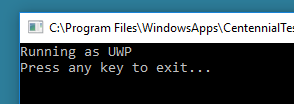

# CentennialTest
C++ sample code for Centennial (Desktop Bridge) apps

# Requirements #

Windows 10 Anniversary Update (10.0.14393.0 and later) Pro or Enterprise edition.

Visual Studio 2015 (Update 3 recommended) with **Universal Windows App Development Tools and Windows 10 Tools and SDKs** [installed](https://msdn.microsoft.com/en-us/library/e2h7fzkw.aspx)

NSIS [installed](http://nsis.sourceforge.net/Download) and in your path 

Desktop App Converter [installed](https://www.microsoft.com/en-us/store/p/desktopappconverter/9nblggh4skzw)
Desktop App Converter [configured ](https://msdn.microsoft.com/en-us/windows/uwp/porting/desktop-to-uwp-run-desktop-app-converter)

## How to build and install AppX ##

1. Right-click on build.bat and select **"Run as administrator"**

1. Appx is in AppxOut\CentennialTest.

1. Right click on AppxOut\CentennialTest\auto-generated.cer and select **"Install Certificate"**

1. Select **"Local Machine"**. Click **"Next"**.

1. Select **"Place All Certificates in the following store"**. Click **"Browse"**.

1. Select **"Trusted Root Certification Authorities"**. Click **"OK"**.  Click **"Next"**.

1. Click **"Finish"**. Click **"Yes"**. Click **"OK"**.

1. Double click on AppxOut\CentennialTest\CentennialTest.appx. Click **"Install"**.

1. Click **"Launch"**. Output should appear as:

 

1. Run Win32 version by double clicking on **Release\CentennialTest.exe**. Output should appear as:

 
